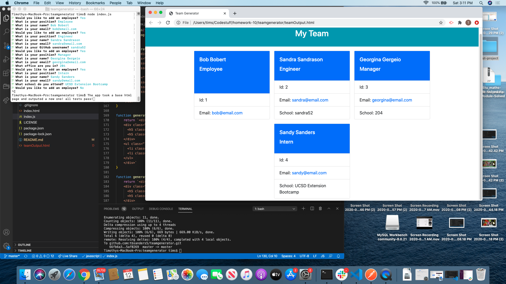

# **Team Generator** #
  

  
  ## View Program ##
  
  

  * [Video Walk-through](https://www.youtube.com/watch?v=-gs6toDjTIs)

  ## Description ##

  An application that lets you add an index of your current employees. It will display basic info and have different options based on the chosen role of the employee.

  ## Table Of Contents ##

  - [Description](#Description)
  - [Installation](#Installation)
  - [Usage](#Usage)
  - [Contributors](#Contributors)
  - [License](#License)
  - [Tests](#Tests)
  - [Repository](#Repository)
  - [Questions](#Questions)

  ## Installation ##

  1. Download file as a zip from the repository
  1. Unzip the file to the local directory  
  1. Download node 
  1. Run npm install 
  1. Open the index page using node index.js 
 
  ## Usage ##

  1. Select yes when prompted to add a new employee
  1. Follow the prompt, answering the questions based on your role 
  1. When you have finished with the first employee you are prompted to add another employee if needed
  1. Select no if finished, if you are adding another employee type 'y' and follow the prompt again
  1. If 'n' is submitted the application will open a window in your browser
  1. Review information to make sure it is correct

  ## Contributors ##

  * [Nancy Lambert-Brown](https://github.com/n-lambert)
  * [Plover Brown](https://github.com/rebgrasshopper)
  * [Nicholas Konzen](https://github.com/NTKonzen)
  * [Talia Vazquez](https://github.com/taliavazquez)
  * [ShieldsIO](https://shields.io/category/license) 
  * [Nodejs.org](https://nodejs.org/en/)
  * [Jest.io](https://jestjs.io/)

  ## License ##

  https://api.github.com/licenses/lgpl-3.0

  ## Tests ##

  1. Change in to the directory folder labeled "tests"
  1. As long as NPM install has been run, you can now run NPM test
  1. Type npm test 'file name to test'
  1. Check that all tests pass
  1. Repeat on all test files until complete

  ## Repository ##

  - [My Projects Repository](https://github.com/tbsanders5/teamgenerator)

  ## Questions ##

  
  - Timothy Sanders
  - [My Profile](https://github.com/tbsanders5)
  - tbsanders5@gmail.com
